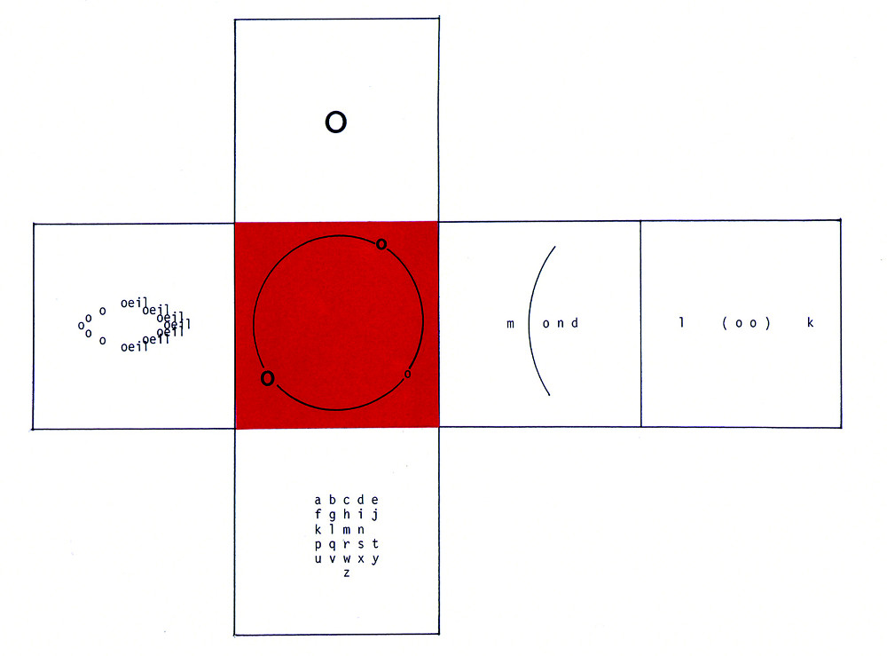

# Lab 1

[py5canvas reference](https://github.com/colormotor/py5canvas/tree/main/docs) (and [p5.js](https://p5js.org/reference/))

## Analogue experiment: Poetry Cubes

1. This poem is Ilse Garnier’s “Jeu de Cubes” from *Puzzle-Alphabet* (1988). Notice how words, letters, or shapes transform as they move across the cube’s faces. Think about how the poem changes when you look at it from different angles.
2. Now, using the provided paper templates, design a cube poem of your own. Decide how text, symbols, or images will appear on each side, and consider how meaning shifts as the cube is turned.
3. In pairs or small groups, share your cube poems. Explore how they can be read, played with, and reassembled, and discuss the different transformations that emerge.

## Programming practice: Installation

In this lab, the technical goals are:
- Clone the course repository using git or download it as a zip.
- Install a code editor if you do not have one (Visual Studio Code is recommended); In VSCode, the recommended plugins are: Jupyter; Python; Markdown All In One; Live Server.
- Follow the instructions in the [`readme.md`](../../readme.md#installation) of the repository to install `miniforge` and:
  - create an environment for the course (called e.g. `poetic.machines`);
  - activate the environment;
  - use `pip` (or `mamba`) to install the required software.
- Once this is done, check that you can:
  - Run a `py5canvas` sketch;
  - Open and run a Jupyter Notebook, and familiarise yourself with the interface (code and markdown cells).
