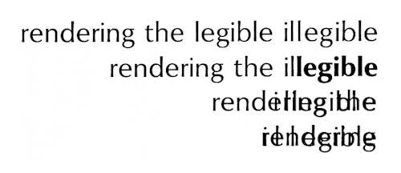
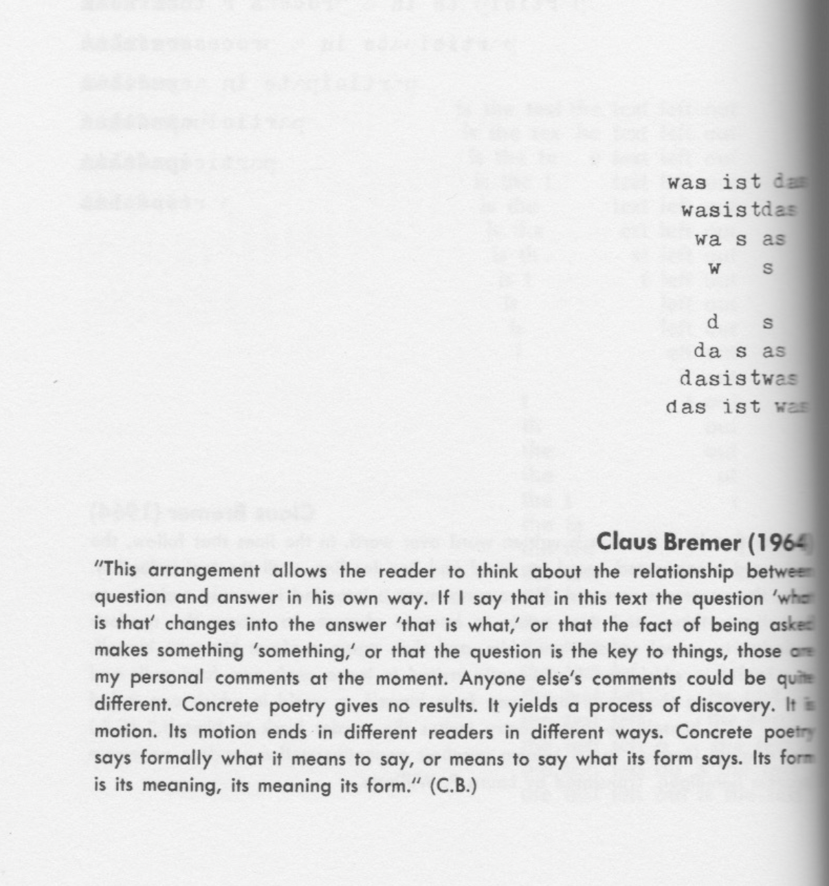
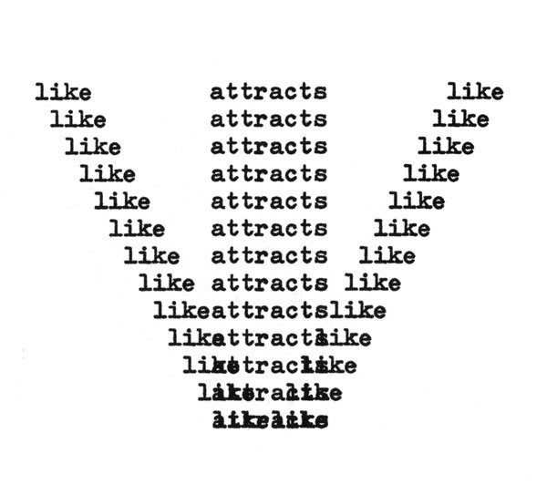
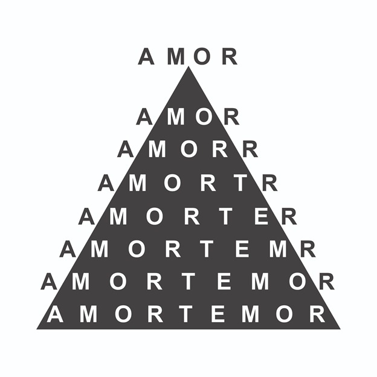
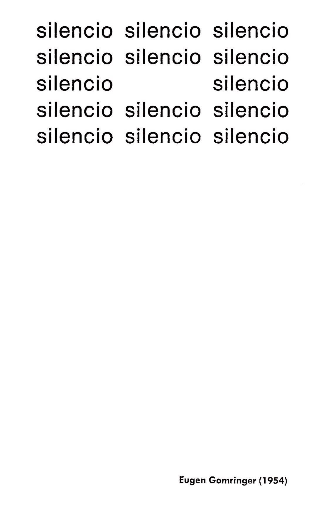
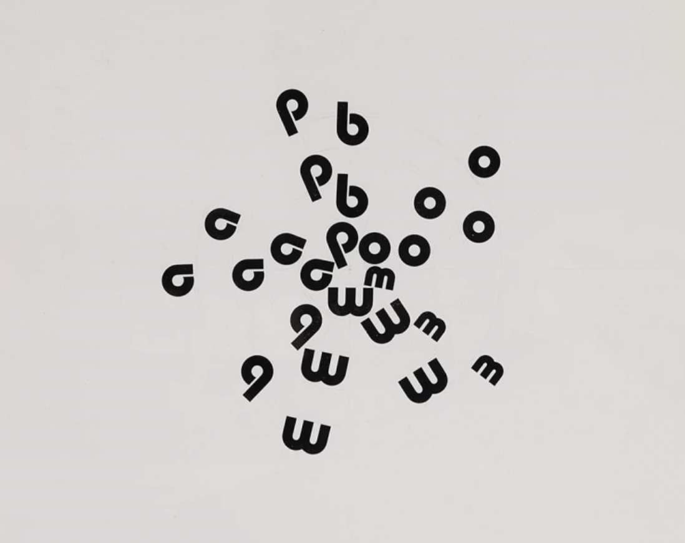
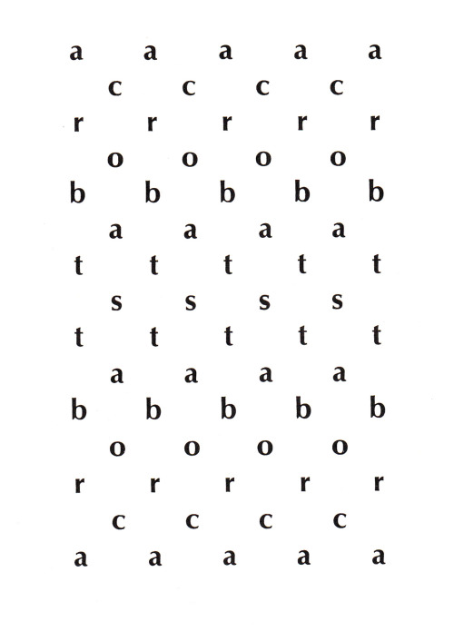
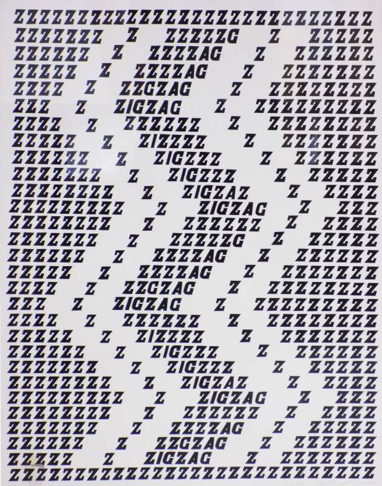
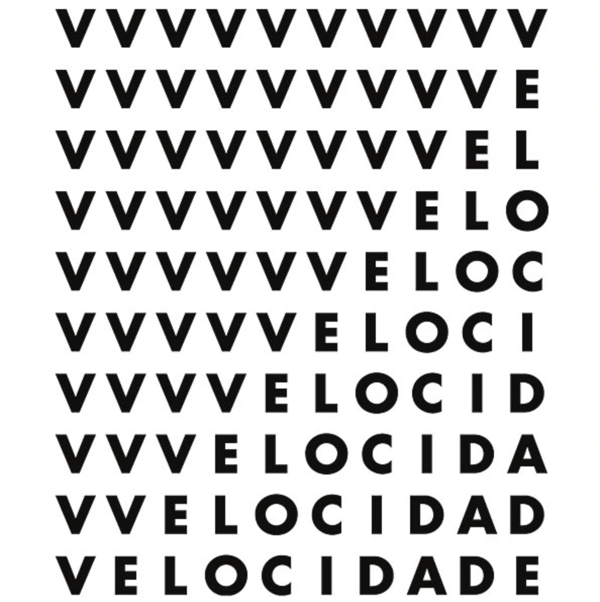
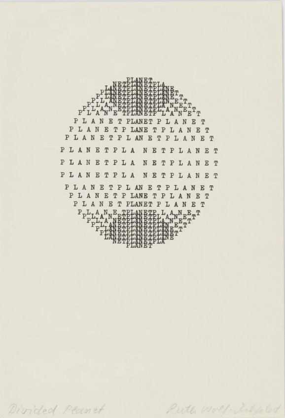

# Lab 2

In each lab, we encourage you to go over the lecture material (the Jupyter notebooks), run things for yourself, try and modify the examples given, think about how they work, and how you could modify them to make them more familiar or useful to you.

[py5canvas reference](https://github.com/colormotor/py5canvas/tree/main/docs) (and [p5.js](https://p5js.org/reference/))

## Analogue Experiment: Poetic Metamorphosis

1. Look back at these metamorphosis poems from today’s lecture. Find or choose one thing you like about them. Think about how each poem transforms, how each transition occurs.  
2. Now, think of words and statements of your own and consider the relationships between them. 
3. In pairs, share your words, use your ideas to make a new idea, and using pen and paper or equivalent devices, sketch out a collaborative metamorphosis poem. 

## Programming practice: Poems that say & do

In this lab, we are making our first steps in `py5canvas`. The concepts for today include:
- the distinction between `setup` and `draw`;
- how to change the background;
- how to draw text on the canvas;
  - how to control its size;
  - how to control its style;
  - how to control its colour (internal with `fill`, outline with `stroke`);
  - how to load and change fonts;
- how to draw shapes;

[py5canvas reference](https://github.com/colormotor/py5canvas/tree/main/docs). Remember, this is very similar to `p5.js`: when in doubt, try and have a look at the reference for this library, or check out the Coding Train on YouTube. The topics are very much the same!

### Note

Often, especially when beginning to program, there can be a mismatch between what you *want* to do, and what you *can* do with your current programming abilities. It can be very fruitful to try and work from both sides of that gap: 1) work directly from programming, and see what the tools allow you to do (and learn new tools in the process); 2) work from your idea or project, formulate it on paper, or draw/type it (using 'old' technology), and think about what would be needed to achieve this with programming.

## Inspirations/Examples

### Poetic Metamorphosis

Claus Bremer, ‘rendering the legible illegible’, (1963).

Claus Bremer, ‘is the text left out’ (translation), (1964).

Claus Bremer, ‘was ist das’, (1964).

Emmett Williams, ‘Like Attracts Like’, (1958).

Augusto de Campos, ‘Amor’, (1970).

---

### Poems that say & do

Eugene Gormringer, ‘Silencio’, 1954.

Augusto de Campos, ‘Poema-bomba’, 1987-94.

Ian Hamilton Finlay, ‘Acrobats’, 1964.

Mary Ellen Solt, ‘Zig Zag’, 1966-71.

Ronaldo Azerendo, ‘Velocidade’, 1957.

Ruth Wolf-Rehfeldt, ‘Divided Planet’, 1980.
