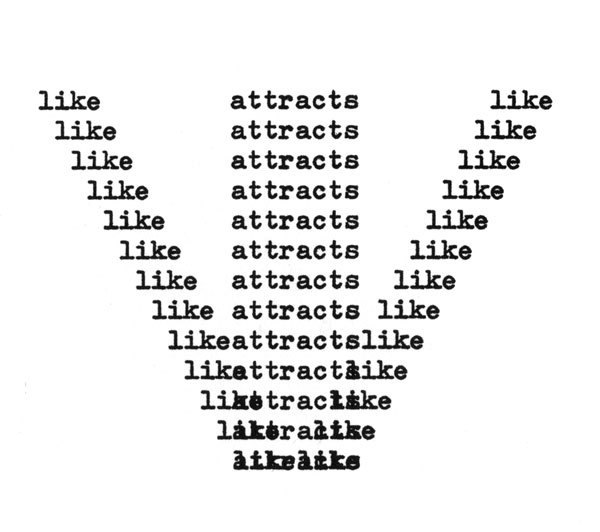
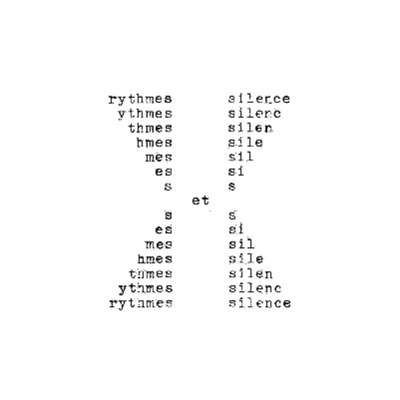
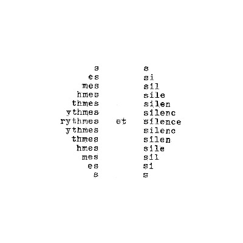
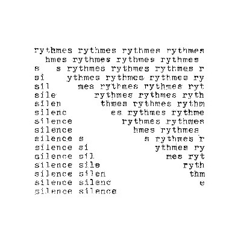
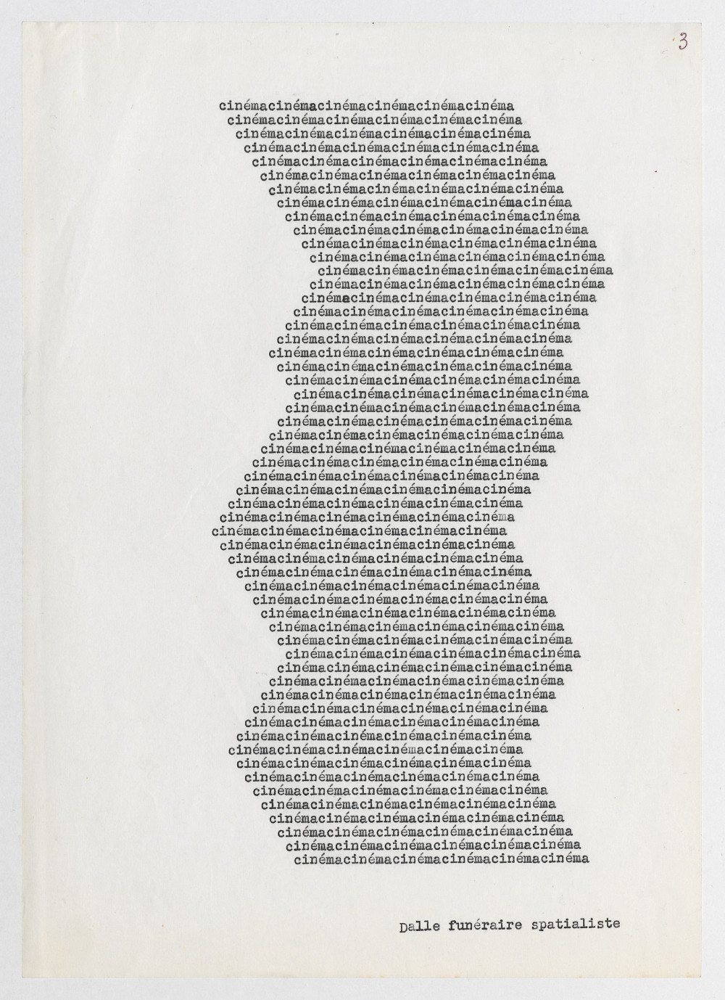

# Lab 3

In each lab, we encourage you to go over the lecture material (the Jupyter notebooks), run things for yourself, try and modify the examples given, think about how they work, and how you could modify them to make them more familiar or useful to you.

[py5canvas reference](https://github.com/colormotor/py5canvas/tree/main/docs) (and [p5.js](https://p5js.org/reference/))

## Analogue Experiment: Poetic Translation

1. Look back at today’s session on Oulipo, generative constraints, and experimental translation. Identify the constraint or method you found most engaging.
2. Work in pairs and select a source material (any material not involving text) for your partner. They will be tasked to translate this material into text using a method of their choice, staying clear of descriptions.
3. Share your translations with each other. Reflect on how different rules, source materials, and approaches shaped the results.

## Programming practice

In this lab, we will focus on the following topics:
- **operations on strings** (especially indexing, slicing and addition/multiplication);
- the use of **variables** to store data;
- the use of **lists** to store multiple pieces of data;
- the use of **loops** to execute commands multiple times.

As a general rule, it is interesting to find other visual poems that seem to be governed with a system of repetition (like a loop): think about how you could implement them, or an approximation of what they do, using programming tools. 

### Inspiration

### Note

Often, especially when beginning to program, there can be a mismatch between what you *want* to do, and what you *can* do with your current programming abilities. It can be very fruitful to try and work from both sides of that gap: 1) work directly from programming, and see what the tools allow you to do (and learn new tools in the process); 2) work from your idea or project, formulate it on paper, or draw/type it (using 'old' technology), and think about what would be needed to achieve this with programming.

## Inspirations/Examples

Emmett Williams, ‘Like Attracts Like’, 1958.

Ilse Garnier, from *Rythmes et Silence*, 1973-75.

Ilse Garnier, from *Rythmes et Silence*, 1973-75.

Ilse Garnier, from *Rythmes et Silence*, 1973-75.

Pierre Garnier, ‘Cinéma’ in *Cimetière spatialiste*, 1973.
 
Some additional examples include [Eugen Gomringer](https://www.instagram.com/p/C4kR0d1uIQ0/) or [Ruth Wolf-Rehfeldt](https://www.richardsaltoun.com/viewing-room/7-ruth-wolf-rehfeldt-letters/). (And itt is perfectly possible to work on examples from previous weeks.)
